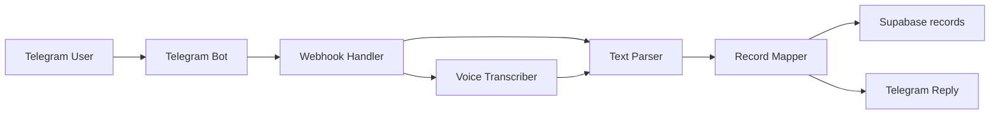

# Telegram Voice MVP Plan

## 1. 目标

给 Bookkeeper 增加一个**单用户自用**的 Telegram 记账入口，支持：

- Telegram 文本记账
- Telegram 语音记账
- 自动写入现有 Supabase `records` 表

第一版只要求保存以下 4 个属性：

1. `amount`
2. `currency`
3. `category`
4. `note`

其中：

- `category` 只走**规则匹配**，命不中直接 `other`
- **不使用 AI 猜分类**
- `note` 直接保存原始文本或转写文本
- 允许后续在前端账本里手动修正分类、备注等内容

## 2. 范围冻结

### 本阶段要做

- Telegram bot 接收文本消息
- Telegram bot 接收语音消息
- 语音先转文字，再复用同一套解析逻辑
- 解析出 `amount / currency / category / note`
- 写入现有 Supabase `records` 表
- bot 回复一条确认消息，说明已记录的结果

### 本阶段不做

- 不做 AI 分类猜测
- 不做多用户
- 不做复杂权限系统
- 不做 Telegram 端多轮对话修正
- 不做前端页面里的 Telegram 深度配置面板
- 不改现有统计、列表、编辑页核心逻辑
- 不新增复杂数据库表，除非后续验证确认确实有必要

## 3. 现有代码边界

### 保持不动的核心前端职责

- [src/App.jsx](/C:/Users/41434/Desktop/spending_record_App/bookkeeper/src/App.jsx)
  继续只负责前端页面切换和视图状态，不塞 Telegram bot 逻辑。

- [src/pages/ListPage.jsx](/C:/Users/41434/Desktop/spending_record_App/bookkeeper/src/pages/ListPage.jsx)
- [src/pages/StatsPage.jsx](/C:/Users/41434/Desktop/spending_record_App/bookkeeper/src/pages/StatsPage.jsx)
- [src/components/RecordForm.jsx](/C:/Users/41434/Desktop/spending_record_App/bookkeeper/src/components/RecordForm.jsx)
  这些页面和组件继续承担 UI 职责，不负责接 Telegram。

### 复用的现有数据结构

- [src/services/recordService.js](/C:/Users/41434/Desktop/spending_record_App/bookkeeper/src/services/recordService.js)
  现有前端写入结构已经明确：`amount / category / currency / note / date / time / tag`。

- [src/config/categories.js](/C:/Users/41434/Desktop/spending_record_App/bookkeeper/src/config/categories.js)
  Telegram 分类规则最终必须只输出这些现有 id：
  - `food`
  - `transport`
  - `shopping`
  - `housing`
  - `entertainment`
  - `baby`
  - `other`

## 4. 推荐架构

不要把 Telegram bot 逻辑放进现有 React 前端，而是新增一个**独立消息接收层**。

推荐数据流：



### 核心原则

- Telegram 接入层与现有前端 UI 解耦
- 文本解析与语音转写解耦
- 分类规则与解析主流程解耦
- 数据写入层与 Telegram API 调用解耦

这样后续要换：

- 语音转写服务
- 分类规则
- Telegram 平台
- 或者新增 WhatsApp / WeChat / 小程序入口

都不会把前端主应用拖乱。

## 5. 目录设计

建议在仓库根目录新增一个独立服务目录：

```text
bookkeeper/
├── src/                          # 现有前端，尽量少动
├── telegram/
│   ├── server.js                 # webhook 入口
│   ├── config.js                 # bot token / webhook / 默认币种 / 环境变量读取
│   ├── handlers/
│   │   └── telegramWebhook.js    # 区分 text / voice / unsupported
│   ├── services/
│   │   ├── telegramApi.js        # 下载文件、回复消息
│   │   ├── speechToText.js       # 语音转文字
│   │   ├── parseRecordText.js    # 文本转账单结构
│   │   ├── categoryRules.js      # 分类规则表
│   │   ├── currencyRules.js      # 币种规则
│   │   ├── amountRules.js        # 金额提取与中文数字转换
│   │   └── supabaseWriter.js     # 直接写入 Supabase
│   └── README.md                 # 独立运行与部署说明
└── TELEGRAM_VOICE_MVP_PLAN.md    # 本文档
```

## 6. 模块职责

### `telegram/server.js`

- 暴露 webhook HTTP 入口
- 只做请求接收、路由分发
- 不写业务解析

### `telegram/handlers/telegramWebhook.js`

- 判断消息类型：文本 / 语音 / 其他
- 把输入交给统一解析流程
- 组装 bot 回复内容

### `telegram/services/speechToText.js`

- 接收 Telegram 语音文件
- 调用语音转写服务
- 第一版优先使用**火山引擎语音转文字 API**
- 输出纯文本
- 不做记账字段解析

### `telegram/services/parseRecordText.js`

- 输入一句文本
- 输出结构化结果：
  - `amount`
  - `currency`
  - `category`
  - `note`
  - `date`
  - `time`

### `telegram/services/categoryRules.js`

- 只做规则匹配
- 命中规则返回 category id
- 未命中直接返回 `other`

### `telegram/services/amountRules.js`

- 负责从中文口语里提取金额
- 必须单独维护，不能散落在主流程里
- 这里会是后续最容易迭代和修复的点

### `telegram/services/currencyRules.js`

- 负责识别 `RMB` / `VND`
- 如果文本中没有显式币种，按默认币种策略处理

### `telegram/services/supabaseWriter.js`

- 负责把结构化结果写入 Supabase
- 尽量与前端 `recordService.js` 的数据格式保持一致

## 7. 默认数据策略

### `amount`

- 必须能解析，否则整条消息不入库
- 失败时 bot 回复“未识别到金额”

### `currency`

- 明确出现“越盾 / VND / dong”时记为 `VND`
- 明确出现“人民币 / 元 / 块 / RMB”时记为 `RMB`
- 如果没写明，先按 Telegram 端默认币种处理

### `category`

- 仅规则匹配
- 规则命中返回对应 category id
- 否则直接 `other`

### `note`

- 直接保存原始文本或转写文本

### `date` / `time`

- 第一版默认用服务器接收消息时的本地时间
- 暂不强做“昨天 / 前天 / 上周”这种自然语言时间解析

### `tag`

- 第一版 Telegram 入口不处理 tag
- 统一写空字符串 `''`

## 8. 分类规则第一版

建议第一版先写死在 `categoryRules.js`：

- `food`
  - 吃饭、午饭、晚饭、早餐、夜宵、咖啡、奶茶、饮料、餐厅、外卖
- `transport`
  - 打车、滴滴、地铁、公交、加油、高速、停车
- `shopping`
  - 买、超市、淘宝、京东、购物、衣服、鞋、日用品
- `housing`
  - 房租、酒店、住宿、水费、电费、燃气、物业
- `entertainment`
  - 电影、游戏、唱歌、KTV、娱乐、门票
- `baby`
  - 奶粉、尿布、宝宝、金宝、婴儿、玩具
- 默认
  - `other`

注意：

- 分类规则要集中放在一个文件，不要散落在 handler 里
- 后面新增关键词时，只改这一个文件

## 9. 部署建议

### 前端

- 继续按现有 [DEPLOYMENT_WORKFLOW.md](/C:/Users/41434/Desktop/spending_record_App/bookkeeper/DEPLOYMENT_WORKFLOW.md) 发布

### Telegram 服务

建议和前端分开部署，不要强耦合：

- 可以单独部署到 Vercel Functions、Railway、Render 或其他支持 webhook 的地方
- 只要能提供 HTTPS webhook 地址即可

原因：

- Telegram webhook 本质是后端服务
- 现有前端部署在 Vercel 上不代表 bot 服务就该和它混在一起
- 独立部署后，后续出问题更容易定位

## 10. 阶段计划与验收门槛

### 阶段 1：架构与目录设计

输出：
- 本文档
- 明确目录结构与模块职责

验收：
- 能说清楚哪些代码放前端，哪些代码放 Telegram 服务
- 能说清楚 `categoryRules`、`parseRecordText`、`supabaseWriter` 三层为什么要拆开

### 阶段 2：文本解析器

输出：
- `parseRecordText.js`
- `amountRules.js`
- `currencyRules.js`
- `categoryRules.js`

验收：
- 用固定样例句子测试
- 每条样例都能输出可检查 JSON
- 分类未命中时明确返回 `other`

样例至少包括：
- “中午吃饭 35 块”
- “打车 120000 越盾”
- “买奶粉 260 人民币”
- “超市买东西 89”
- “交房租 3000”

### 阶段 3：语音转文字

输出：
- `speechToText.js`

验收：
- 选 5 到 10 条真实语音样本
- 转写文本可读
- 金额与币种能被阶段 2 解析器正确抽取

第一版实现约束：
- 优先使用火山引擎语音转文字 API
- 允许保留 provider 抽象，但默认 provider 为 `volcengine`
- 如果不使用控制台直接签发的固定 token，则需支持：
  - `VOLCENGINE_ACCESS_KEY`
  - `VOLCENGINE_SECRET_KEY`
  - `VOLCENGINE_SPEECH_APPKEY`
  由服务端换取短期 token 后再调用语音识别接口

### 阶段 4：Telegram bot 回复解析结果

输出：
- `server.js`
- `telegramWebhook.js`
- `telegramApi.js`

验收：
- 发文本，bot 能回解析结果
- 发语音，bot 能回解析结果
- 失败消息能正确提示原因

### 阶段 5：Supabase 正式入库

输出：
- `supabaseWriter.js`

验收：
- 用 Telegram 发至少 5 条测试消息
- 前端账本里能看到新记录
- 统计页与列表页正常

### 阶段 6：文档与部署闭环

输出：
- `telegram/README.md`
- 更新 `HANDOFF_LOG.md`
- 如有必要，更新 `README.md`

验收：
- 按文档可重新配置 bot
- 可重新部署 webhook
- 可完成一次“发语音 -> 自动入库 -> 前端看到记录”的全链路演示

## 11. 本阶段不建议做的事

- 不要一开始就把“昨天、前天、上周”时间语义做复杂
- 不要一开始就加 tag 自动判断
- 不要一开始就引入 AI 分类回退
- 不要把 Telegram token、Supabase service role key 直接写死在前端仓库代码里
- 不要把 Telegram 接入直接塞进现有 React 页面逻辑

## 12. 当前结论

这个 Telegram 语音记账需求，按当前约束做成 MVP 是可控的。

关键不是“AI 多聪明”，而是：

- 结构干净
- 规则集中
- 文本解析先单独验证
- 语音只是文本输入的另一种来源
- 每一阶段都能单独验收

后续真正开始开发时，应严格按阶段推进，上一阶段验证通过后，才进入下一阶段。
## 2026-05-16 Stable Webhook Alignment Note

The Telegram connection layer should now follow the same stable pattern already proven in another app:

- Prefer Vercel serverless webhook instead of temporary local tunnels
- Verify `x-telegram-bot-api-secret-token` against `TELEGRAM_WEBHOOK_SECRET`
- Always return HTTP `200` after business handling, unless the secret is invalid
- Treat Telegram reply sending as non-critical path
- Download voice files through the standard Telegram flow:
  - `getFile`
  - `https://api.telegram.org/file/bot<TOKEN>/<file_path>`
  - convert binary to Base64 inside our own service
- For this repo, use the older Volcengine async AUC ASR flow that is already proven elsewhere:
  - `https://openspeech.bytedance.com/api/v1/auc/submit`
  - `https://openspeech.bytedance.com/api/v1/auc/query`
  - `Authorization: Bearer; <token>`

This note does not change the staged rollout order. It only locks the connection-layer implementation so later iterations do not drift back to unstable tunnel-first testing.
If older sections in this file still mention `resource_id`, `api/v3/auc/bigmodel`, or `VOLCENGINE_SPEECH_API_KEY`, treat them as superseded exploration history.
